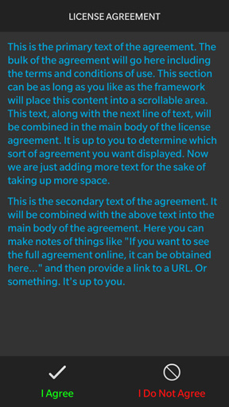

# EULA

This framework is intended to provide an easy-to-use EULA component which can be included with any BlackBerry 10 WebWorks application. The developer can leverage
a series of translated UTF-8 EULA documents to be presented to the end-user at application launch. The selected EULA is based on the device language.


**Agreement Format**

This framework depends on UTF-8 text documents that contain the translated EULA ready to be presented. The framework assumes four (4) sections separated by newline characters as follows:
* Section 0: Agreement title, example: License Agreement
* Section 1: Agreement section one; primary agreement text.
* Section 2: Agreement section two; secondary agreement text.
* Section 3: Accept/decline verbiage.

The accept/decline verbiage should be separated by a **tab** character. Example:

    Agree Verbiage  Decline Verbiage

An example of an agreement is as follows:

    LICENSE AGREEMENT
    This is the primary text of the agreement. The bulk of the agreement will go here including the terms and conditions of use. This section can be as long as you like as the framework will place this content into a scrollable area. This text, along with the next line of text, will be combined in the main body of the license agreement. It is up to you to determine which sort of agreement you want displayed. Now we are just adding more text for the sake of taking up more space.
    This is the secondary text of the agreement. It will be combined with the above text into the main body of the agreement. Here you can make notes of things like "If you want to see the full agreement online, it can be obtained here..." and then provide a link to a URL. Or something. It's up to you.
    I Agree I Do Not Agree


**Applies To**

* [BlackBerry 10 WebWorks SDK 2.0](https://developer.blackberry.com/html5/download/sdk)


**Author(s)**

* [Erik Oros](http://www.twitter.com/waterlooerik)
* [Adam Stanley](http://www.twitter.com/n_adam_stanley)

**Screenshot**



**Dependencies**

N/A


**To contribute code to this repository you must be [signed up as an official contributor](http://blackberry.github.com/howToContribute.html).**


## How to Use


**index.html**

In order to leverage this framework, you must include the corresponding CSS resource:

    <link type="text/css" rel="stylesheet" href="./eula/eula.css" />

As well as the corresponding JavaScript resources:

    <script type="text/javascript" src="local:///chrome/webworks.js"></script>
    <script type="text/javascript" src="./eula/eula.js"></script>

This framework relies on WebWorks APIs, thus must be invoked after the **webworksready** event has fired. Sample usage is as follows:

    <script type="text/javascript">
        window.addEventListener('DOMContentLoaded', function () {
            document.addEventListener('webworksready', function () {
                initEULA(function () {
                    console.log('EULA accepted.');
                });

                document.querySelector('#eula').show(true);
            }, false);
        }, false);
    </script>

**initEULA** must be called first. It contains an **optional** parameter for a callback function; triggered when the EULA is accepted. Following this, **show** can be called.
This will display the EULA to the end user if:
* The *alwaysShow* argument is set to **true**
* The EULA has not been previously accepted.

If the *alwaysShow* argument is set to **false** or omitted, the EULA will only be shown until the first acceptance. After being accepted, it will not be shown again. This is
achieved by storing a flag in Local Storage.

In the event that a callback is specified and *alwaysShow* is **not true**, the callback will be triggered even if the EULA has already been accepted; in short, a specified callback
is **always** triggered after callign **show**.


**eula.css**

Essentially all of the styling for this framework is contained in the noted CSS file. By modifying the existing styling, you can safely alter the visual styles.


**eula.js**

The core functionality of this framework relies on retrieving the UTF-8 document via an XMLHttpRequest object. The naming convention for your agreements can be
modified to suit your needs here:

    xhr.open('GET', './eula/agreements/agreement_' + lang + '.txt', true);


**Config.xml**

The following feature must be included in your project's config.xml.
```
<feature id="blackberry.app" />
<feature id="blackberry.system" />
```


## How to Build

1. Clone this repo to your local machine.

2. Ensure the [BlackBerry 10 WebWorks SDK 2.0](https://developer.blackberry.com/html5/download/sdk) is correctly installed.

3. Open a command prompt (windows) or terminal (mac) and run the following command:

    ```
    webworks create <your source folder>\EULA
    ```

4. **Replace** the default EULA\www folder with the \www folder from **this** project

5. **Replace** the default EULA\config.xml with the config.xml from **this** project

6. From the command prompt (Windows) or terminal (mac), navigate to the EULA folder

    ```
    cd <your source folder>\EULA
    ```

7. Run the following commands to configure plugins used by **this app**

    ```
    webworks plugin add com.blackberry.app
    webworks plugin add com.blackberry.system
    ```

8. Run the following command to build and deploy the app to a device connected via USB

    ```
    webworks run
    ```

## More Info

* [BlackBerry HTML5 WebWorks](https://bdsc.webapps.blackberry.com/html5/) - Downloads, Getting Started guides, samples, code signing keys.
* [BlackBerry WebWorks Development Guides](https://bdsc.webapps.blackberry.com/html5/documentation)
* [BlackBerry WebWorks Community Forums](http://supportforums.blackberry.com/t5/Web-and-WebWorks-Development/bd-p/browser_dev)


## Contributing Changes

Please see the [README](https://github.com/blackberry/BB10-WebWorks-Samples) of the BB10-WebWorks-Samples repository for instructions on how to add new Samples or make modifications to existing Samples.


## Bug Reporting and Feature Requests

If you find a bug in a Sample, or have an enhancement request, simply file an [Issue](https://github.com/blackberry/BB10-WebWorks-Samples/issues) for the Sample.

## Disclaimer

THE SOFTWARE IS PROVIDED "AS IS", WITHOUT WARRANTY OF ANY KIND, EXPRESS OR IMPLIED, INCLUDING BUT NOT LIMITED TO THE WARRANTIES OF MERCHANTABILITY, FITNESS FOR A PARTICULAR PURPOSE AND NONINFRINGEMENT. IN NO EVENT SHALL THE AUTHORS OR COPYRIGHT HOLDERS BE LIABLE FOR ANY CLAIM, DAMAGES OR OTHER LIABILITY, WHETHER IN AN ACTION OF CONTRACT, TORT OR OTHERWISE, ARISING FROM, OUT OF OR IN CONNECTION WITH THE SOFTWARE OR THE USE OR OTHER DEALINGS IN THE SOFTWARE.
